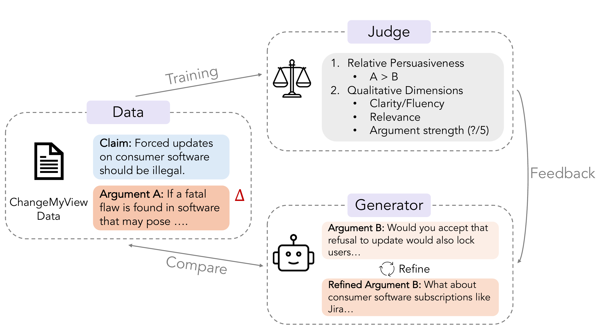

<h1 align="center">Fine-tuning Language Models for Persuasive Argumentation</h1>

<b>Group 12 | CS 6120: Natural Language Processing</b>

Tanmay Demble, Shivansh Shukla, Suk Jin Mun, Josh Jestine, Sijia Chen, Jiayi Zhang

## Overview

People often lack opportunities to receive critical feedback on their arguments before important presentations or discussions. While large language models can generate fluent responses, they typically provide surface-level suggestions rather than structured, adversarial critique that exposes weaknesses in reasoning. We develop an argumentative assistant that helps users strengthen their reasoning. It questions their claims, probes for clarity, and highlights logical gaps. Our goal is to ground this feedback in empirical signals of persuasion success rather than generic language quality alone.

## Workflow

  

We use the ChangeMyView data to train a judge that evaluates relative persuasiveness, such as whether Argument A is more persuasive than Argument B. The judge also assesses qualitative dimensions such as clarity, fluency, relevance, and argument strength through an LLM-as-a-judge. We also build an argument generator that uses prompting, in-context learning, or behavior cloning. The generator uses feedback from the judge to iteratively refine its arguments into more persuasive versions.

## Data

We use the Winning Arguments corpus from Cornell's ConvoKit, which contains ChangeMyView debate threads with delta annotations that indicate persuasion success. Each discussion thread is structured as main claims and a sequence of responses. This structure allows us to model persuasion at the level of individual replies.

## Baseline

We use both open-sourced models like Llama-3.1-8b and closed-sourced models like GPT-4.1-mini with only prompting to serve as the baseline. These models generate argumentative responses with generic instruction prompts and have no exposure to persuasion knowledge in the prompt.

## Evaluation

We first train a judge based on the existing CMV data using delta or total upvotes as the label. We also use LLM-as-a-judge prompted with different personas to assess the persuasiveness to different groups of people. Automatic evaluation focuses on the predicted likelihood of persuasion success. LLM-as-a-judge assesses qualitative dimensions such as clarity, relevance, and argumentative strength.
